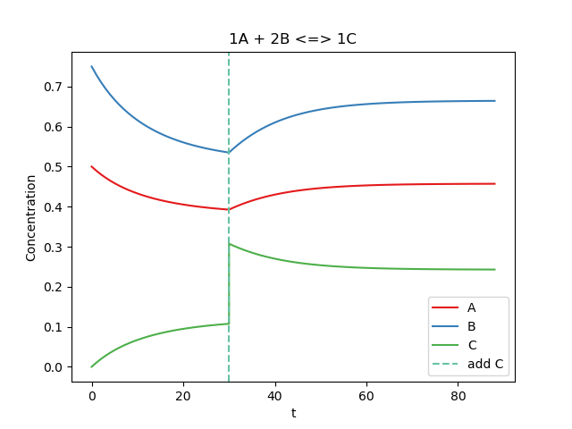

# Equilibrium
Simulate chemical equilibrium and generate plots! A working example is located in `main.py`.

## Steps to Use
1. Initialize `Element` objects with a coefficient and initial concentration.
These represent products/reactants during the simulation.
2. Initialize `Event` objects if you wish to change an element's concentration or `K` during the simulation.
3. Initialize a `Reaction` by specifying `K`, the reactants, the products, and the events to take into account during the sim.
4. Run the simulation using the `react_until_eq` method.
5. Plot the reaction using the `plot` method.

## Example Plot (main.py)

